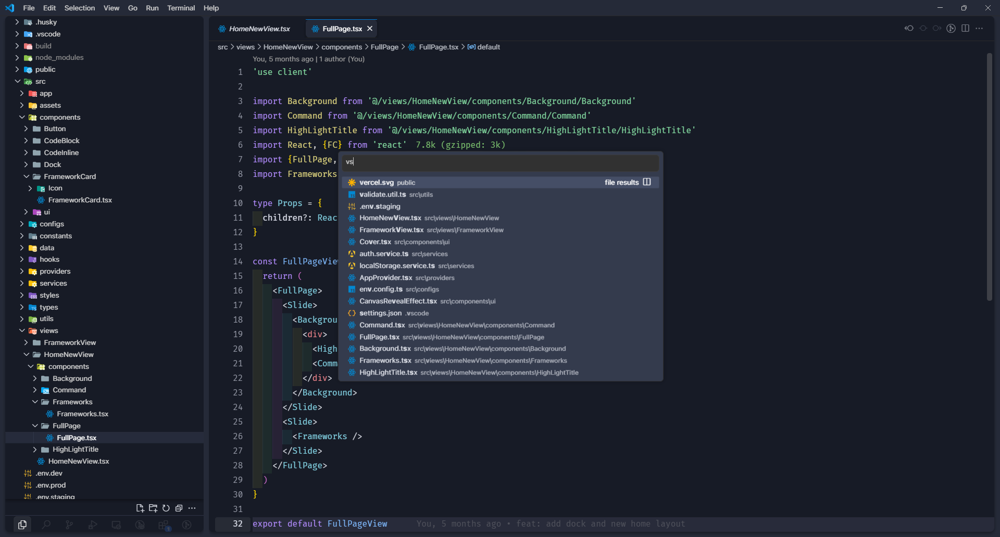
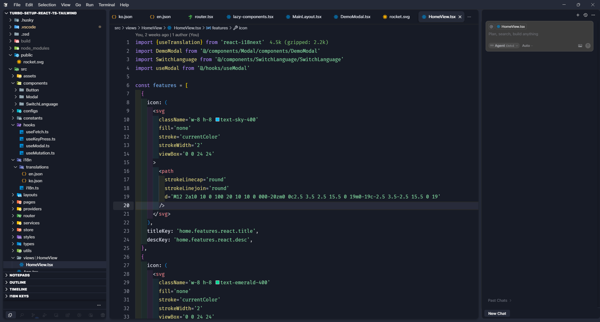

# ✨ Vibe Code UI ✨

A beautiful, modern, and highly customized Visual Studio Code UI experience.

Transform your VSCode into a stunning, productive environment with custom UI styles, fonts, and settings.

---

## 🚀 Quick Start

1. **Install the Required Extension**

   - [Custom UI Style Extension](https://marketplace.visualstudio.com/items?itemName=subframe7536.custom-ui-style)

2. **Apply the Settings**

   - Copy `settings.json` from this repo.
   - In VSCode: `Ctrl+Shift+P` → "Preferences: Open Settings (JSON)" → Paste & Save.

3. **Install the Fonts**

   - Open the `fonts` folder.
   - Install all fonts from:
     - `FiraCode/` (recommended for code)
     - `SF Pro Text/` (UI & sans-serif)
     - `segoe-ui-4-cufonfonts/` (extra UI compatibility)
   - **Windows:** Right-click font → "Install for all users"
   - **Mac:** Double-click font → "Install Font"
   - **Linux:** Use your system's font manager

4. **(Optional) Customize Further**
   - Want more customization? Edit settings.json to suit your vibe.

---

## ✨ Features

• Modern, glassy, rounded UI
• Custom sidebar & panels
• Enhanced color & icon theme
• Smooth font ligatures
• Optimized for Fira Code,
SF Pro Text, Segoe UI

---

## 🙏 Credits

- [Custom UI Style Extension](https://marketplace.visualstudio.com/items?itemName=subframe7536.custom-ui-style)
- [Nerd Fonts](https://github.com/ryanoasis/nerd-fonts)
- [Fira Code](https://github.com/tonsky/FiraCode)
- Special thanks to [iLiranS](https://gist.github.com/iLiranS/a02c01a31176127a7e35c5ce170b8331)

---

## 🛠️ Troubleshooting

- UI not updating? Run "Custom UI Style: Reload" from the Command Palette.
- More help: [Custom UI Style extension FAQ](https://github.com/subframe7536/vscode-custom-ui-style#faq)

---

## 📄 License

- See individual font folders for their licenses.
- The rest: MIT License.

---

Enjoy your new VSCode vibe! 🎉
